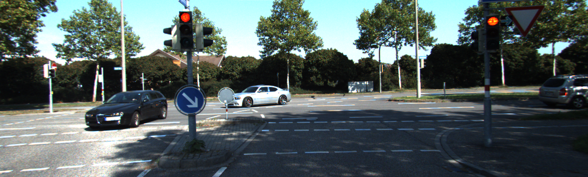
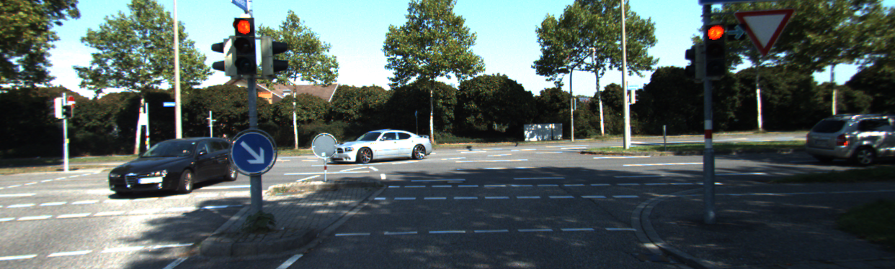
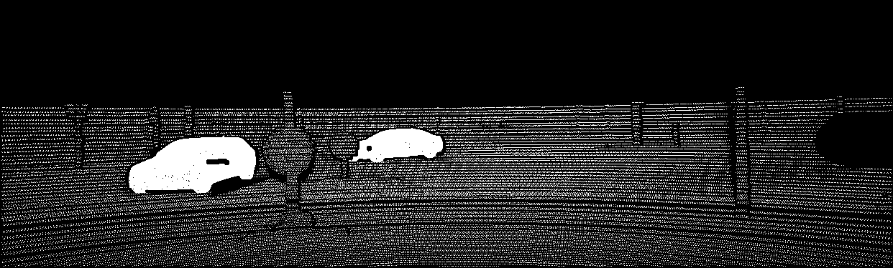
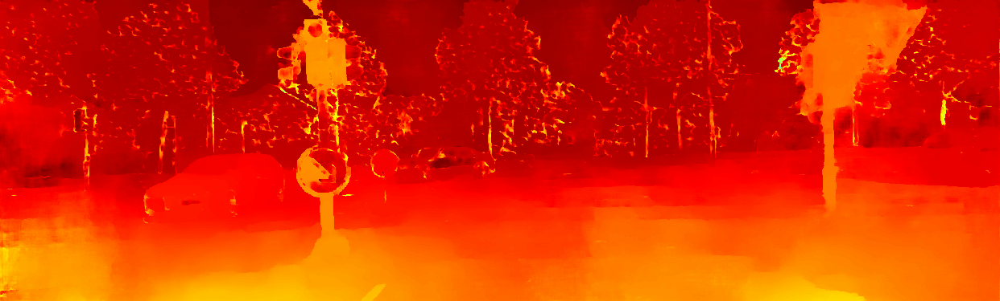

# StereoDepthEstimation

## Installation
```bash
conda create -n stereo-depth python=3.10
conda activate stereo-depth
# Установить pytorch с официального сайта https://pytorch.org
pip install -r requirements.txt
```

# Inference Example
Left Image

Right Image

Ground True Disparity

Predicted Disparity
